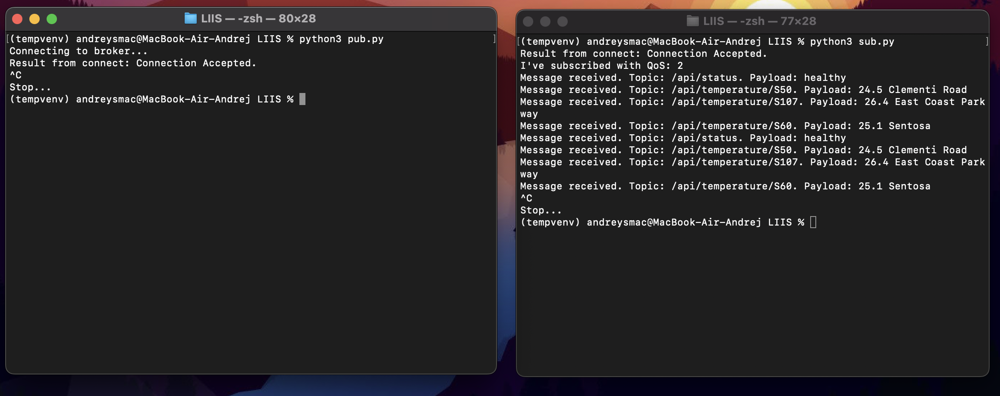

# MQTT_Weather

**Задача**: Нужно забрать показания температуры погоды по API для станции с ID S50, S107, S60 и статус "api_info" и передать в MQTT брокер с шифрованием SSL и аутентификацией. Стандартный порт брокера – 8885.

Готовое задание должно содержать:
  3 топика с id и температурой. Адрес топика должен иметь вид: /api/temperature/id
  1 топик статус api_info. Адрес топика должен иметь вид: /api/status

Итоговая задача была разбита на два этапа:
1. Получение данных о погоде со стороннего API
2. Отправка полученных данных на  MQTT брокер (SSL + Auth)

Для получения данных о погоде был разработан программный код **"Weather.py"**. Класс _weather_, представленный в данном файле, предназначен для извлечения наименования города и показателя температуры со станций ID S50, S107, S60, а также для извлечения статуса. Результат раюоты функции представляет собой json словарь.

Для выполнения второго этапа был разработан файл-publisher - **Pub.py**. Разработанная функция автоматически, используя импортированный класс _weather_ получает данные о погоде, и отправляет полученные данные на брокер, используя защищенное SSL соединение. Метод аутентификации выбран _'read and write'_. 

_Дополнительно при полуении данных о погоде была добавлена переменная merge. Данная переменная позволяет отправлять брокеру нетолько данные о погоде, но и информацию касаемо местонахождения объекта, как представлено на рисунке 1_

Рисунок 1. Пример работы алгоритма с использованием merge

Для тестирования разработанного алгоритма был дополнительно разработан алгоритм-subscriber - **Sub.py**. Данный алгоритм позволяет подключиться к брокеру по защищенному соединению SSL и получить необходимые данные, передаваемые условным сервером\датчиком (Pub.py). Для считывания всех под-топиков сразу был выбран универсальный топик "/api/#". Результат работы алгоритма представлен на рисунке 2

Рисунок 2. Результат работы алгоритма

Заключительным этапом задания было необходимо выполнить компиляцию программы для windows. Так как выбранный язык программирования Python является  не компилируемым для выполнения данной задачи был выбран сторонний компилятор с открытым кодоми - Nuitka [https://nuitka.net/], позволяющий переформатировать исходный py Ккод в язык Си без потери в качестве работы софта и с увеличением скорости работы. Помимо этого подобный метод компиляции защищает алгоритм от декомпеляции и расшифровки программного кода. Скомпилированные программы Sub.py и Pub.py находятся в архиве **"CompiledWindows.zip"**  в виде **.exe** файлов. (Запускаются из собственных репозиториев)
